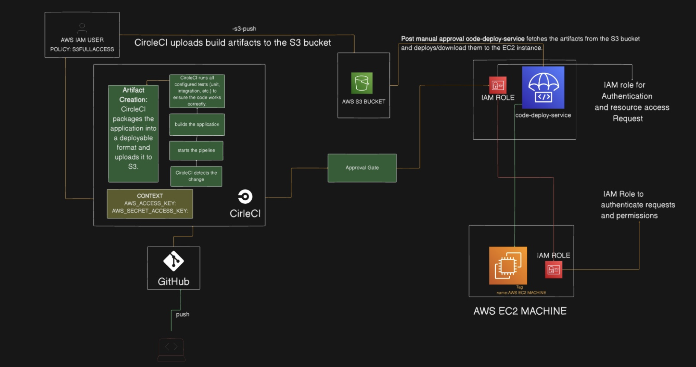
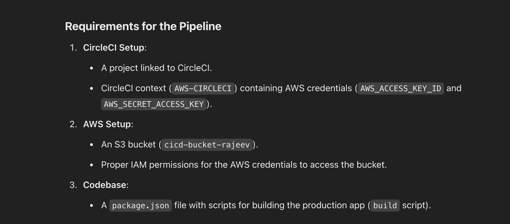
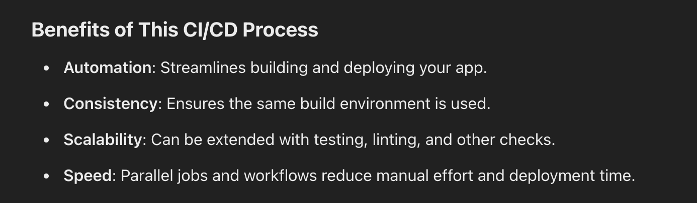

# circleci-cicd-pipeline

.circleci/config.yaml

```
---
version: 2.1
jobs:
  build:
    docker:
      - image: circleci/node:14
    steps:
      - checkout
      - run:
          name: install dependencies
          command: npm i
     # - run:
      #    name: Run Test
       #   command: npm test
      - run:
          name: Build Production
          command: npm run build
      - persist_to_workspace:
          root: .
          paths:
            - build
  s3-push:
    docker:
      - image: cimg/python:3.8.16
    steps:
      - checkout
      - attach_workspace:
          at: .
      - run:
          name: Install AWS CLI
          command: pip install  awscli
      - run:
          name: null
          command: |
            aws s3 sync build s3://cicd-bucket-rajeev
workflows:
  buildandpushs3:
    jobs:
      - build
      - s3-push:
          requires:
            - build
          context: AWS-CIRCLECI


```

Explanation:
The provided config.yaml file is a CircleCI configuration for setting up a CI/CD pipeline. It consists of two jobs: build and s3-push, orchestrated in a workflow named buildandpushs3. Below is a step-by-step explanation of each part:


CircleCI Configuration Overview
CircleCI uses this configuration file (config.yaml) to automate workflows for building, testing, and deploying applications. This pipeline consists of two jobs:

- build - Responsible for building the application.
- s3-push - Syncs the built application files to an AWS S3 bucket.

#

File Breakdown
Version

```
version: 2.1
```

- Specifies the CircleCI configuration syntax version.
- Version 2.1 supports advanced features like reusable configurations and workflows.

#

## Jobs Section

Jobs are independent tasks that CircleCI runs. Each job specifies:

- The Docker image to use.

- The steps to execute (e.g., checkout, build, test, deploy).

#

Job 1: build
This job is responsible for:

- Checking out the code.
- Installing dependencies.
- Building the production application.
- Persisting the build output for use in subsequent jobs.

```
build:
  docker:
    - image: circleci/node:14

```

- docker: Specifies the runtime environment. The circleci/node:14 Docker image is used, which has Node.js 14 installed.
- This ensures consistency in the Node.js version across environments.

Steps:

```
steps:
  - checkout

```

- checkout: Checks out the code from the version control system (e.g., GitHub, Bitbucket) into the build container.

```
  - run:
      name: install dependencies
      command: npm i

```

- run: Executes a shell command.
- npm i: Installs the project's dependencies as defined in the package.json.

```
  # - run:
  #     name: Run Test
  #     command: npm test

```

- Commented Section: This part is currently disabled. It could be uncommented to run tests using npm test.

```
  - run:
      name: Build Production
      command: npm run build

```

- npm run build: Executes the production build script (defined in package.json), generating the production-ready assets.

```
  - persist_to_workspace:
      root: .
      paths:
        - build

```

- persist_to_workspace

  - Saves the build folder (containing production assets) to CircleCI's workspace.
  - The workspace enables sharing files between jobs in the same workflow.

  #

  Job 2: s3-push
  This job is responsible for:

- Syncing the build artifacts to an AWS S3 bucket.

```
s3-push:
  docker:
    - image: cimg/python:3.8.16

```

- docker: Specifies the runtime environment. The cimg/python:3.8.16 Docker image includes Python 3.8 and tools like pip.

```
steps:
  - checkout

```

- checkout: Checks out the code repository (needed for consistency or version control metadata).

```
  - attach_workspace:
      at: .

```

- attach_workspace
  - Restores the workspace created in the build job.
  - Makes the build folder available in this job.

```
  - run:
      name: Install AWS CLI
      command: pip install awscli

```

- Installs the AWS CLI (Command Line Interface), used to interact with AWS services like S3.

```
  - run:
      name: null
      command: |
        aws s3 sync build s3://cicd-bucket-rajeev

```

- aws s3 sync:
  - Syncs the build folder to the specified S3 bucket (s3://cicd-bucket-rajeev).
  - The AWS CLI uses credentials stored in the CircleCI context (AWS-CIRCLECI) to authenticate.

#

Workflows
Workflows orchestrate the sequence and dependencies of jobs.

```
workflows:
  buildandpushs3:
    jobs:
      - build
      - s3-push:
          requires:
            - build
          context: AWS-CIRCLECI

```

- buildandpushs3: Workflow name.
- Executes the build job first.
- After build is complete, runs the s3-push job.
  requires:

requires:

- Ensures s3-push runs only after build completes successfully.

context: AWS-CIRCLECI:

- Specifies a predefined CircleCI context (AWS-CIRCLECI) containing AWS credentials.
- These credentials are used by the AWS CLI to authenticate and interact with the S3 bucket.

#

# CI/CD Pipeline Summary

1. Build Phase (build job):

- Sets up a Node.js environment.
- Checks out the code.
- Installs dependencies (npm i).
- Builds the production application (npm run build).
- Stores the build artifacts in the workspace.

2. Deploy Phase (s3-push job):

- Sets up a Python environment.
- Restores the build artifacts from the workspace.
- Installs the AWS CLI.
- Syncs the production build to an S3 bucket using AWS CLI.
  
  
