# 1.

- Deployment Code: <font style="color: red">d-AV8G2Q6NA</font>
- Error Code: <font style="color: red">UnknownError</font>
- Most recent event: <font style="color :red">ApplicationStop</font>

## Description:

<font style="color: yellow">CodeDeploy Agent</font> was not able to receive the lifecycle event. Check the CodeDeploy agent logs on your host and make sure the agent is running and can connect to the CodeDeploy server.
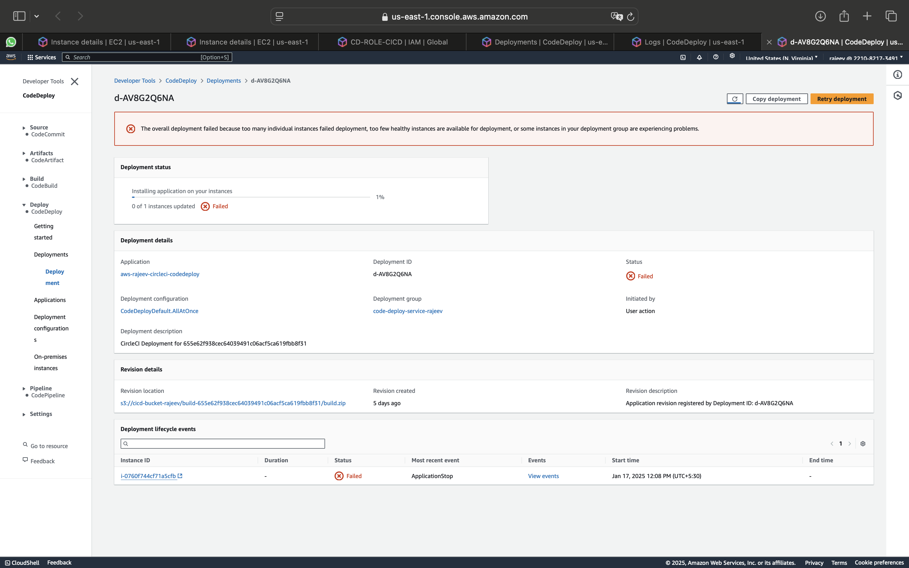
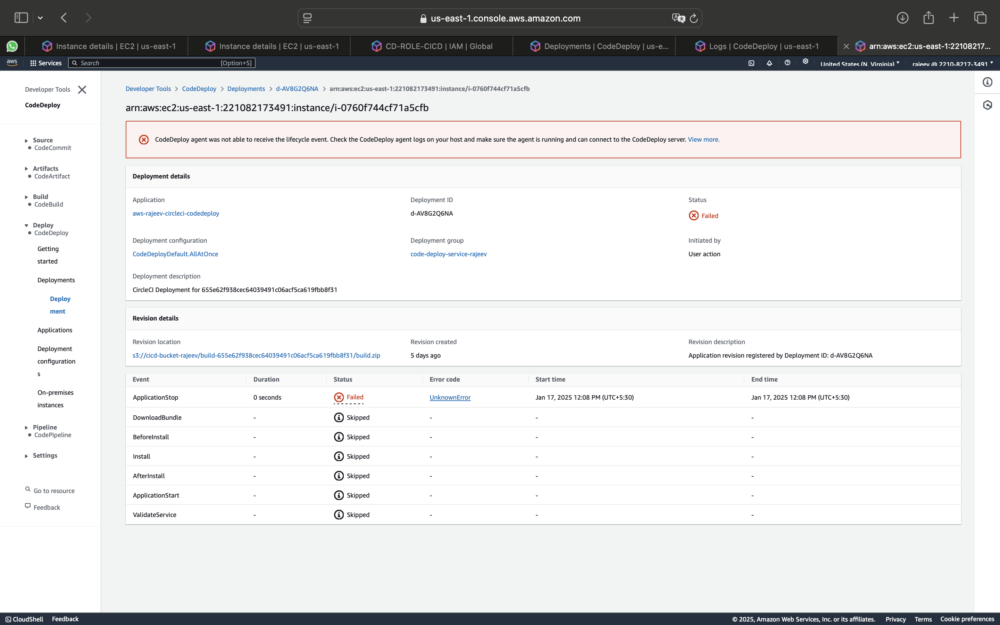
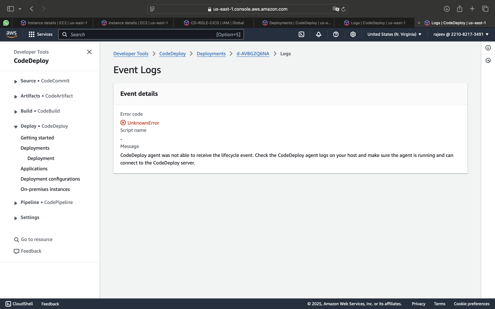

## Cause:

1. Check <font style="color: yellow">CodeDeploy Agent</font> is installed or not on EC2 machine, If not then follow below steps to install the CodeDeploy agent on Ubuntu Server

   - To check <font style="color: yellow">CodeDeploy Agent</font> Agent is install or not enter the following command

   ```
    systemctl status codedeploy-agent

   ```

   or

   ```
   sudo service codedeploy-agent status
   ```

   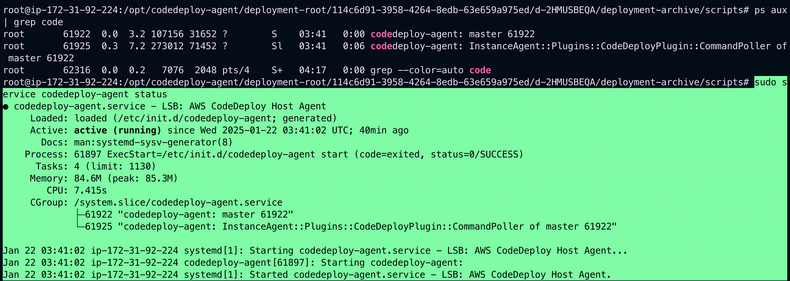

2. Check appspec extension which should be <font style="color: yellow">appspec.yml</font> but if your's is <font style="color: red">appspec.yaml</font> then change to <font style="color: yellow">appspec.yml</font>
   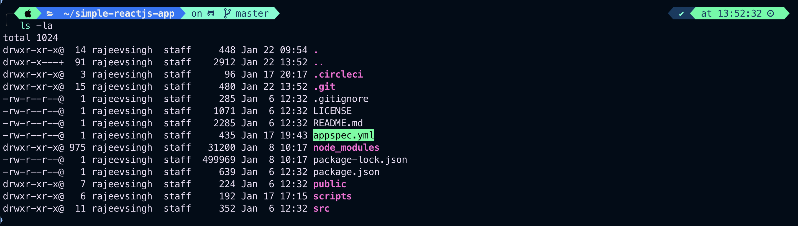

## Resolution

### To install the CodeDeploy agent on Ubuntu Server

1. Sign in to the instance.
2. Enter the following commands, one after the other:

```
sudo apt update
```

```
sudo apt install ruby-full
```

```
sudo apt install wget
```

3. Enter the following command:

```
cd /home/ubuntu
```

<font style="color: red">/home/ubuntu</font> represents the default user name for an Ubuntu Server instance. If your instance was created using a custom AMI, the AMI owner might have specified a different default user name.

4. Enter the following command:

```
wget https://aws-codedeploy-us-east-1.s3.us-east-1.amazonaws.com/latest/install
```

5. Enter the following command:

```
chmod +x ./install
```

6. Do one of the following:

- To install the latest version of the CodeDeploy agent on any supported version of Ubuntu Server except 20.04:

```
sudo ./install auto
```

- To install the latest version of the CodeDeploy agent on Ubuntu Server 20.04:

```
sudo ./install auto > /tmp/logfile
```

### To check that the service is running

1. Enter the following command:

```
systemctl status codedeploy-agent
```

If the CodeDeploy agent is installed and running, you should see a message like The AWS CodeDeploy agent is running.

2. If you see a message like error: No AWS CodeDeploy agent running, start the service and run the following two commands, one at a time:

```
systemctl start codedeploy-agent
```

```
systemctl status codedeploy-agent
```

### Example

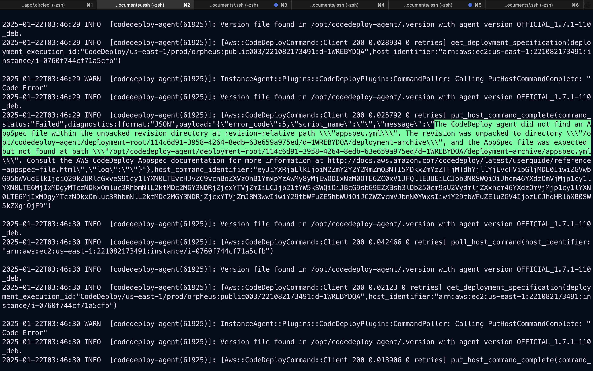

## Additional Notes

- If the last deploy-aws job is done successfully on CircleCi
  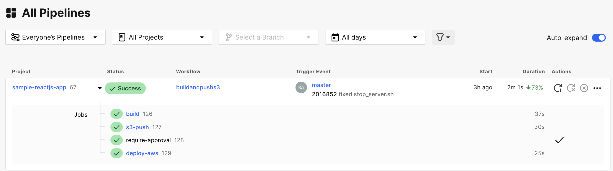
  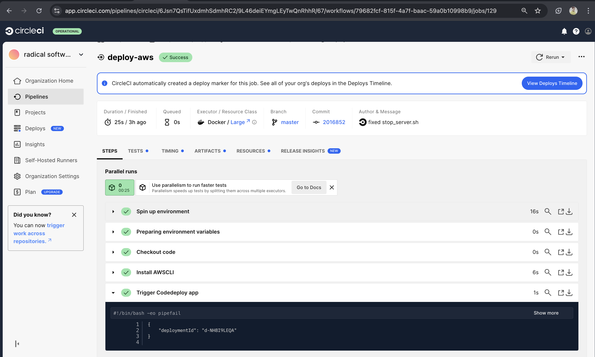

then you can go to CodeDeploy on AWS console Management to see further Deployment processes defined in **appspec.yml** and **/scripts/scripts.sh**.
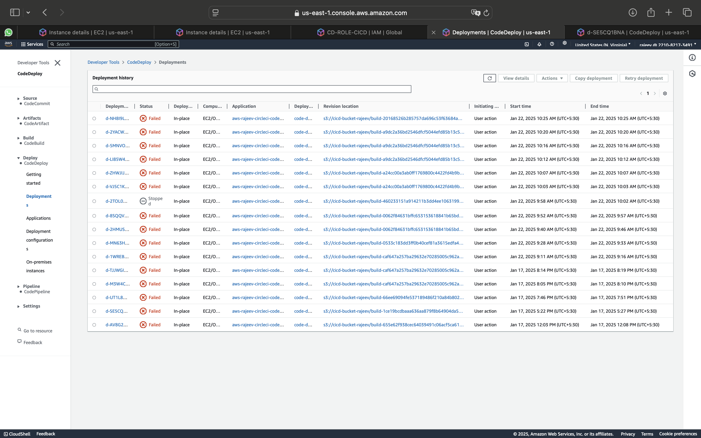
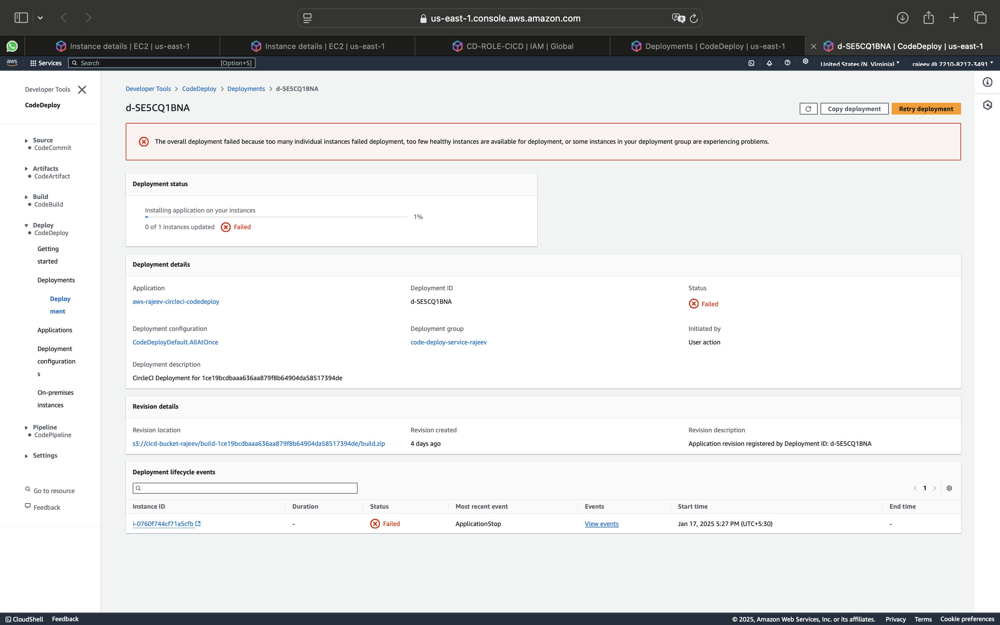

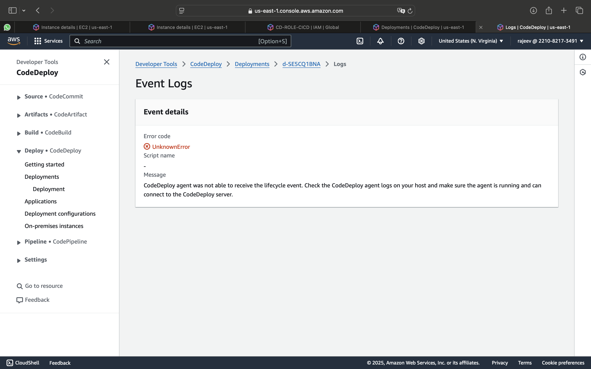

### Ensure your <span style="color: yellow">stop_server.sh</span> , <span style="color: yellow">start_server.sh</span>, <span style="color: yellow">before.sh</span>, <span style="color: yellow">validate.sh</span> file does not have any error (syntax or other), Use this script for comparision.

```
vim stop_server.sh
```

```
#!/bin/bash

#set errors if any command is not execute successfully
set -e
echo "Appliction stop is underway...."
#application dir
APP_DIR="/home/ubuntu/react-app"
# Port on which our app is running
PORT=5000
# find process id
PID=$(lsof -t -i:$PORT || true)
#
if [ -n "$PID" ]; then
echo "Killing Process"
kill -9 $PID
fi

echo "Application Stopped"
```

#

```
vim start_server.sh
```

```
#Application Start
#!/bin/bash
set -e
echo "Starting Application"
APP_DIR="/home/ubuntu/react-app"
PORT=5000
cd $APP_DIR
nohup npm serve -s $APP_DIR -l $PORT
echo "App Stored"
```

#

```
vim before.sh
```

```
# Before Install
#!/bin/bash
set -e
APP_DIR="/home/ubuntu/react-app"
rm -rf $APP_DIR
```

#

```
vim validate.sh
```

```
# Before Install
#!/bin/bash
set -e
APP_DIR="/home/ubuntu/react-app"
rm -rf $APP_DIR
```

# 2.

- Deployment Code: <font style="color: red">d-MN63HEDQA</font>
- Error Code: <font style="color: red">UnknownError</font>
- Most Recent Event: <font style="color :red">BeforeInstall</font>
  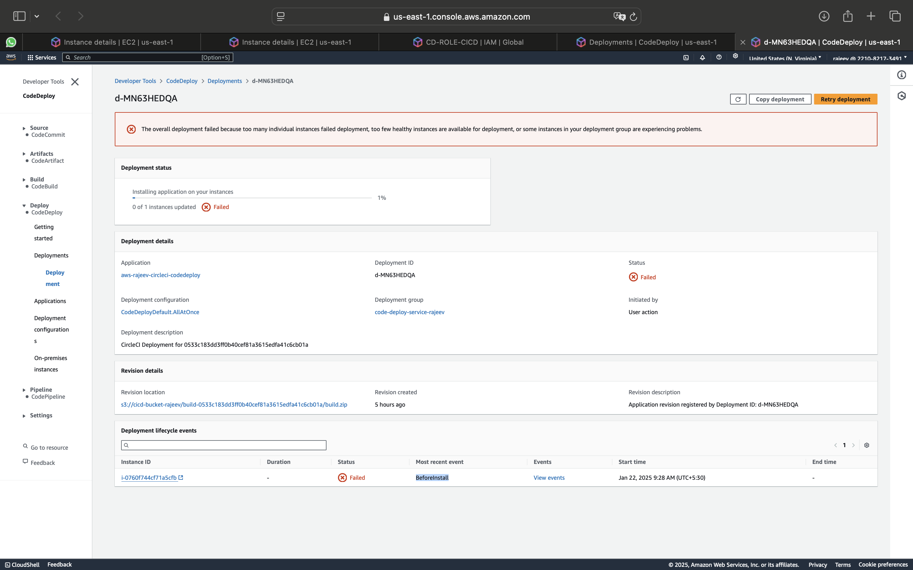
  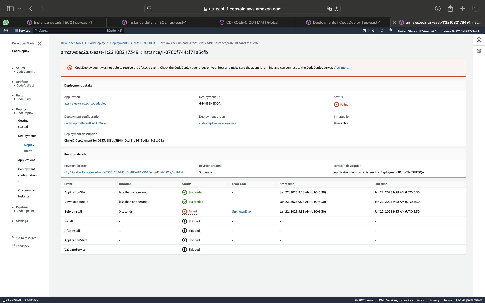

## Cause:

before.sh file may have syntax error or invalid argument so check your before.sh file and correct errors if any exist.
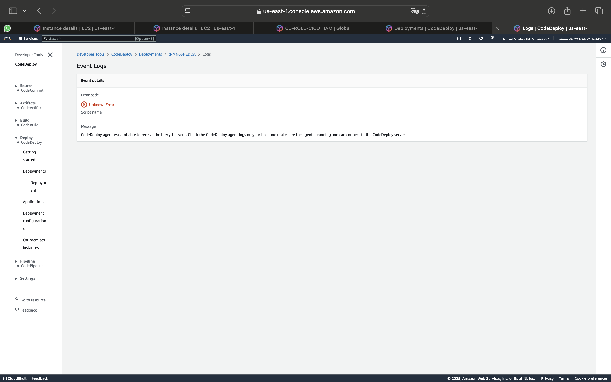

### Use below example for comparision

```
# Before Install
#!/bin/bash
set -e
APP_DIR="/home/ubuntu/react-app"
rm -rf $APP_DIR
```

### To see before.sh file on EC2 instance enter below command

```
sudo su
```

```
cd /opt/codedeploy-agent/deployment-root/ && ls ls -la
```

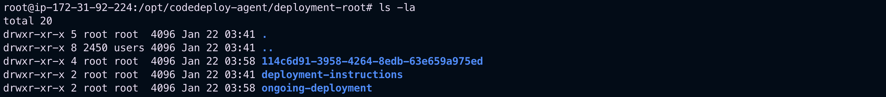

```
cd 114c6d91-3958-4264-8edb-63e659a975ed/

ls -la
```

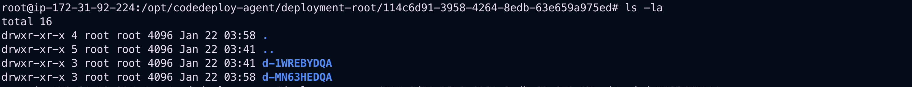
Select the failed <font style="color: yellow">Deployment Id</font>

```
cd d-MN63HEDQA/ && ls -la
```

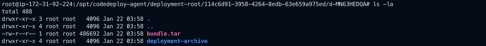

```
cd deployment-archive/ && ls -la
```

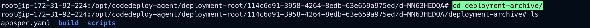

```
cd scripts/ && ls -la
```

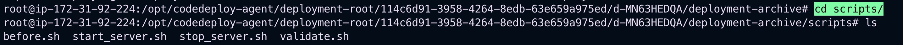

### now run before.sh to identify the issue

```
bash before.sh
```

or

```
./before.sh
```

#

# To check logs

### Check Logs to identify the issues

```
cd /var/log/ && ls -la
```

```
cd aws/ && ls -la
```

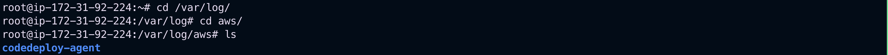

```
cd codedeploy-agent/ && ls -la
```

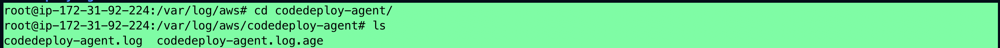

```
tail -f codedeploy-agent.log
```

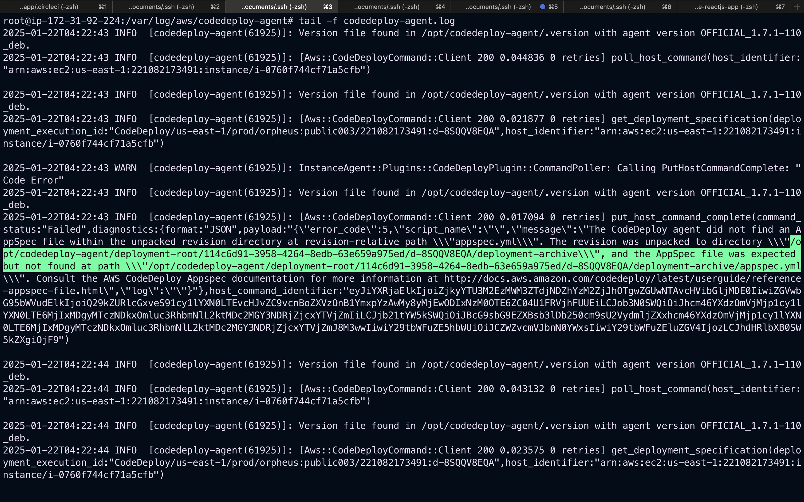

- Make sure your config.yml contains the same extension as mentioned above in logs : <font style="color: yellow"> appspec.yml</font>

```
config.yml
```

```
version: 2.1
jobs:
  build:
    docker:
    - image: circleci/node:14
    steps:
    - checkout
    - run:
        name: install dependencies
        command: npm i
    # - run:
    #    name: Run Test
    #   command: npm test
    - run:
        name: Build Production
        command: npm run build
    - run:
        name: Create a ZIP file
        command: zip -r build.zip build appspec.yml scripts
    - persist_to_workspace:
        root: .
        paths:
        - build.zip
  s3-push:
    docker:
    - image: cimg/python:3.8.16
    steps:
    - checkout
    - attach_workspace:
        at: .
    - run:
        name: Install AWS CLI
        command: pip install  awscli
    - run:
        name: null
        command: |
          aws s3 cp build.zip s3://cicd-bucket-rajeev/build-$CIRCLE_SHA1/build.zip
  deploy-aws:
    docker:
    - image: cimg/python:3.8.16
    steps:
    - checkout
    - run:
        name: Install AWSCLI
        command: pip install awscli
    #      - run:
    #          name: Check for Active Deployment
    #          command: |
    #            ACTIVE_DEPLOYMENT=$(aws deploy list-deployments \
    #            --application-name aws-rajeev-circleci-codedeploy \
    #            --deployment-group-name code-deploy-service-rajeev \
    #            --include-only-statuses Created Queued InProgress \
    #            --region us-east-1 --output text --query "deployments[0]")

    #           if [ "$ACTIVE_DEPLOYMENT" != "None" ]; then
    #            echo "Active deployment found: $ACTIVE_DEPLOYMENT. Stopping it."
    #            aws deploy stop-deployment --deployment-id $ACTIVE_DEPLOYMENT --region us-east-1
    #            fi
    - run:
        name: Trigger Codedeploy app
        command: |
          aws deploy create-deployment \
            --region us-east-1 \
            --application-name aws-rajeev-circleci-codedeploy \
            --deployment-group-name code-deploy-service-rajeev \
            --s3-location bucket=cicd-bucket-rajeev,key=build-$CIRCLE_SHA1/build.zip,bundleType=zip \
            --description "CircleCI Deployment for $CIRCLE_SHA1"

workflows:
  buildandpushs3:
    jobs:
    - build
    - s3-push:
        requires:
        - build
        context: AWS-CIRCLECI
    - require-approval:
        type: approval
        requires:
        - s3-push
    - deploy-aws:
        requires:
        - require-approval
        context: AWS-CIRCLECI
```

- Check appspec file extension, it should be <font style="color: yellow"> appspec.yml</font>

# 3.

- Deployment Code: <font style="color: red">d-VJ5C1KEQA</font>
- Error Code: <font style="color: red">ScriptFailed</font>
- Most Recent Event: <font style="color :red">BeforeInstall</font>
- Script name: <font style="color :red">scripts/start_server.sh</font>
- Message: Script at specified location: scripts/start_server.sh run as user root failed with exit code 127

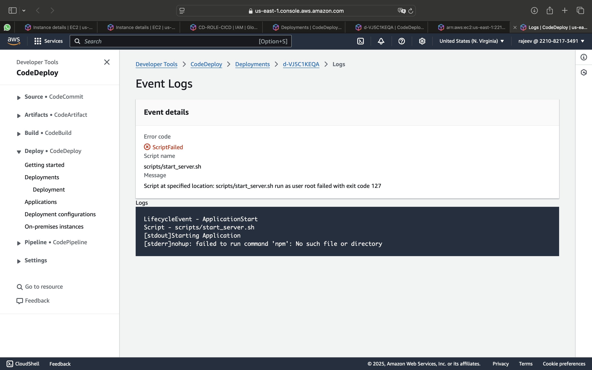

The error message indicates that the npm command is not found, which means Node.js and npm (Node Package Manager) are not installed or not available in the deployment environment.

### Error Details:

- <font style="color: red">**Error: nohup**</font>: failed to run command 'npm': No such file or directory
- <font style="color: red">**Exit Code**</font>: 127 (command not found)

## Causes:

1. Node.js and npm are not installed on the target instance.
2. Environment PATH issue: The PATH variable does not include the location of the npm binary.
3. Permission issues: The deployment user does not have access to execute npm.

### Steps to Resolve:

1. Verify if Node.js and npm are Installed

   - Log in to the target EC2 instance.
   - Run the following commands to check if Node.js and npm are installed:

   ```
   node -v
   npm -v
   ```

   If these commands return an error or are not found, Node.js is not installed.

2. Install Node.js and npm

   - Install Node.js on the target instance to enable npm.

   ```
   sudo apt update
   sudo apt install -y nodejs npm
   ```

   Verify Installation:

   After installation, verify that Node.js and npm are installed:

   ```
   node -v
   npm -v
   ```

3. Debugging Tips
   Check logs (/var/log/aws/codedeploy-agent/codedeploy-agent.log) for more details.

```
cd /var/log/ && ls -la
```

```
cd aws/ && ls -la
```


```
cd codedeploy-agent/ && ls -la
```


```
tail -f codedeploy-agent.log
```

# 4

- Deployment Code: <font style="color: red">**d-LI85W4FQA**</font>
- Error Code: <font style="color: red">**ScriptFailed**</font>
- Most Recent Event: <font style="color :red">**stop_server.sh**</font>
- Script name: <font style="color :red">**scripts/stop_server.sh**</font>
- Message: Script at specified location: **scripts/start_server.sh** run as user root failed with exit code 127
  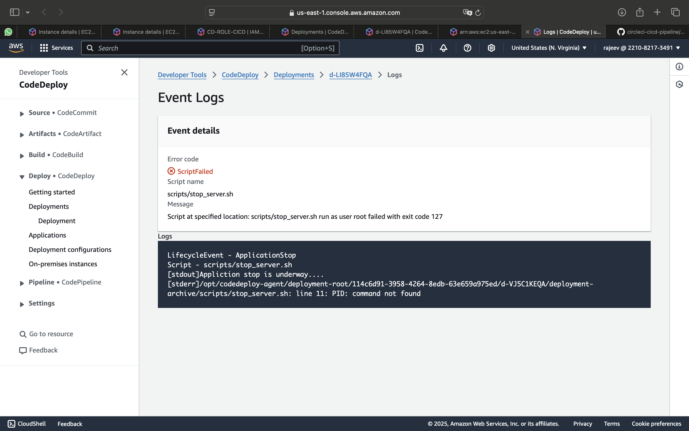
  The error in the scripts/stop_server.sh script indicates that the PID variable is causing an issue, specifically with the error: PID: command not found. This happens because the shell interprets PID as a command instead of a variable.

## Problem:

- The PID variable is incorrectly interpreted, likely due to a syntax issue.
- This could be caused by incorrect quotes or an invalid command substitution.

## Fix:

Here’s the corrected stop_server.sh script:

```
#!/bin/bash

# Exit script if any command fails
set -e

echo "Application stop is underway...."

# Application directory
APP_DIR="/home/ubuntu/react-app"

# Port on which the app is running
PORT=5000

# Find the process ID
PID=$(lsof -t -i:$PORT || true)

if [ -n "$PID" ]; then
  echo "Killing Process with PID $PID"
  kill -9 "$PID"
fi

echo "Application Stopped"

```

## Explanation of Changes:

1. Fixed the PID variable assignment:

- Ensured that the output of lsof -t -i:$PORT is assigned to PID.
- Used || true to handle cases where no process is found (prevents script failure).

2. Added double quotes around $PID:

- Prevents errors if PID is empty.

3. Improved Debugging:

- Added a message to show the PID being terminated.

## Additional Steps:

1. Ensure lsof is Installed:

- On the target EC2 instance, confirm that lsof is installed:

```
sudo apt install lsof -y
```

2. Check Script Permissions:

- Make sure the script has execution permissions:

```
cd /opt/codedeploy-agent/deployment-root/114c6d91-3958-4264-8edb-63e659a975ed/d-2TOL0ZEQA/deployment-archive/scripts
```

```
sudo chmod +x stop_server.sh
```

```
ls -ltr
```

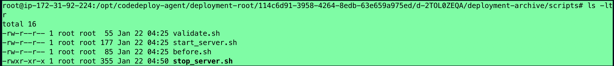

```
cat stop_server.sh
```

```
#!/bin/bash

#set errors if any command is not execute successfully
set -e
echo "Appliction stop is underway...."
#application dir
APP_DIR="/home/ubuntu/react-app"
# Port on which our app is running
PORT=5000
# find process id
PID=$(lsof -t -i:$PORT || true)
#
if [ -n "$PID" ]; then
echo "Killing Process"
kill -9 $PID
fi

echo "Application Stopped"
```

## execute it to verify

```
bash stop_server.sh
```

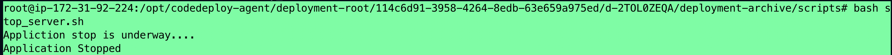
